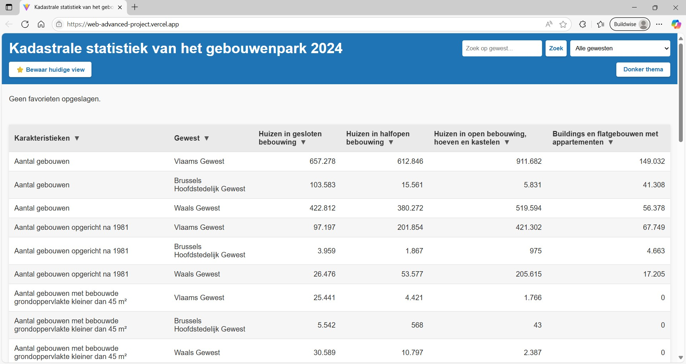
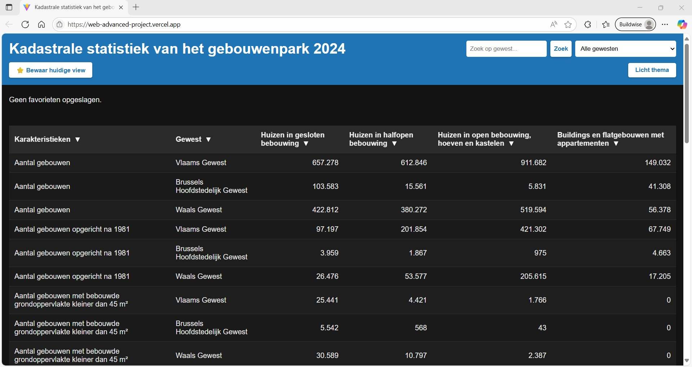
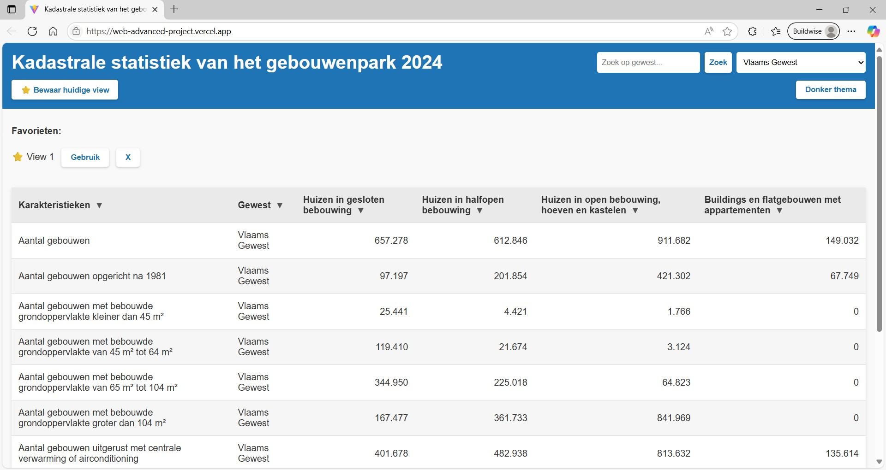

# Web Advanced Project

## I. Projectbeschrijving en functionaliteiten

Dit project toont **kadastrale statistieken van het gebouwenpark** (Statbel API) in een webapplicatie gebouwd met **Vite** en **moderne JavaScript** (ES6+).  
De toepassing ondersteunt data ophalen, normaliseren, filteren, sorteren en weergeven in een tabel.

**Live URL:** [https://web-advanced-project.vercel.app/](https://web-advanced-project.vercel.app/)  
**Repo:** [https://github.com/Lindexlsx/WebAdvancedProject](https://github.com/Lindexlsx/WebAdvancedProject)

### Functionaliteiten

#### Dataverzameling & -weergave
- Data opgehaald uit de publieke Statbel Bestat **API** (endpoint met >20 objecten) (src/api/client.js, regels 4–19).
- **Normalisatie** van ruwe data naar een bruikbaar formaat (src/api/client.js, regels 21–65).
- **Tabelweergave** met 6 kolommen: karakteristieken, gewest, gesloten/halfopen/open bebouwing en gebouwen (src/pages/Home.js, regels 22–69).

#### Interactiviteit
- **Filter functionaliteit** op gewest (src/components/Filters.js, regels 67–75).
- **Zoekfunctie** op gewest (src/components/Filters.js, regels 29–66).
- **Sorteermogelijkheden** voor alle kolommen, oplopend/ aflopend, via kolompijltjes (src/pages/Home.js, regels 15–20 en 71–82).

#### Personalisatie
- **Favoriete views** opslaan in localStorage: data wordt bewaard tussen sessies (max. 3 met overschrijving; src/lib/storage.js, regels 17–41).
- **Weergave en beheer van favorieten**: lijst van opgeslagen views tonen en beheren (src/components/Filters.js, regels 77–122).
- **Thema-switcher** (licht/donker): voorkeur van gebruiker wordt bewaard tussen sessies (src/main.js, regels 28–39; styling in src/styles/styles.css, regels 113–133).

#### Gebruikerservaring
- **Responsive design**: controls naast elkaar of onder elkaar (src/styles/styles.css, regels 43–55).
- **Visueel aantrekkelijke interface**: eenvoudige, moderne styling; duizendtallen met puntnotatie en rechts uitgelijnd in tabel (src/pages/Home.js, regels 52–66 + src/styles/styles.css, regels 144–146); knoppen consistent opgemaakt met subtiele schaduw (src/styles/styles.css, regels 71–82); ...
- **Gebruiksvriendelijke navigatie**: zoekveld; filters; intuïtief sorteren van kolommen via pijltjes; sticky header voor zowel de app-header als de tabelkop (src/styles/styles.css, regels 20–29 en 91–96).

---

## II. Gebruikte API’s

- **Statbel Bestat API**  
  Endpoint:  
  [https://bestat.statbel.fgov.be/bestat/api/views/6077dab9-47e8-468f-a53a-5237fa0673d6/result/JSON](https://bestat.statbel.fgov.be/bestat/api/views/6077dab9-47e8-468f-a53a-5237fa0673d6/result/JSON)  
  Documentatie/bron: [https://statbel.fgov.be](https://statbel.fgov.be)

---

## III. Implementatie van technische vereisten

### DOM manipulatie
- **Elementen selecteren**: zie document.getElementById(...) bv. in src/pages/Home.js, regel 3.
- **Elementen manipuleren**: dynamisch HTML genereren in src/pages/Home.js, regels 22–69.
- **Events aan elementen koppelen**: sorteerpijltjes in src/pages/Home.js, regels 71–82; zoekveld in src/components/Filters.js, regels 29–66.

### Modern JavaScript
- **Gebruik van constanten**: const store = initStore() in src/main.js, regel 7.
- **Template literals**: tabelrendering met backticks in src/pages/Home.js, regels 22–69.
- **Iteratie over arrays**: tabelrendering: rows.map(...) om alle rijen op te bouwen in src/pages/Home.js, regels 47–66.
- **Array methodes**:   
  - filter() en forEach() in src/api/client.js, regels 27–44.
  - map() in src/pages/Home.js, regels 47–66.
- **Arrow functions**: rows.map(r => ...) in src/pages/Home.js, regel 47.
- **Conditional (ternary) operator**: sorteercondities in src/state/store.js, regels 23–37.
- **Callback functions**:
  - Zoek- en filtercallback: renderFilters(store, () => { renderHome(store, getVisibleRecords(store)); }); in src/main.js, regels 19–22.
  - Favorieten toepassen: callback in src/components/Filters.js, regels 108–116 (onChange() na het laden van een favoriet).
- **Promises**:
  - Fetch API: const res = await fetch(url) in src/api/client.js, regel 8.
  - Error handling via try/catch rond Promise: in src/api/client.js, regels 5–19.
- **Async & Await**: fetch en verwerking in src/api/client.js, regels 4–19.
- **Observer API**: observer API om themawissels te loggen in localStorage: MutationObserver in src/lib/themeObserver.js, regels 1–14.

### Data & API
- **Fetch om data op te halen**: await fetch(url) in src/api/client.js, regel 8.
- **JSON manipuleren en weergeven**: normalisatie: samenvoegen naar gesloten, halfopen, open, gebouwen in src/api/client.js, regels 27–44 + rendering: dynamische tabel met numerieke formatting in src/pages/Home.js, regels 47–66.

### Opslag & validatie
- **Formulier validatie**: minimale lengte zoekterm en gewest-check in src/components/Filters.js, regels 39–55.
- **Gebruik van LocalStorage**: opslag views in src/lib/storage.js, regels 17–41 en 43–48.

### Styling & layout
- **Basis HTML layout**: header, favorites-bar, table in index.html, regels 10–27.
- **Basis CSS**: body/layout (src/styles/styles.css, regels 1–19), controls (43–55), knoppen (71–82), tabel (84–101), dark theme (113–133).
- **Gebruiksvriendelijke elementen**: header en tabelkop (src/styles/styles.css, regels 20–29, 91–96).

### Tooling & structuur
- **Project opgezet met Vite** (zie package.json).
- **Correcte folderstructuur**:
  - src/api → data-ophalen en normaliseren (client.js)
  - src/components → UI-elementen (Filters.js, Table.js)
  - src/pages → rendering logica (Home.js)
  - src/state → state management (store.js)
  - src/lib → hulpmiddelen (storage.js, themeObserver.js)
  - src/styles → CSS (styles.css)
  - index.html → root HTML

---

## IV. Installatiehandleiding

1. **Clone repository**
   ```bash
   git clone https://github.com/Lindexlsx/WebAdvancedProject.git
   cd WebAdvancedProject

2. **Installeer dependencies**
   ```bash
   npm install

3. **Start development server**
   ```bash
   npm run dev

4. **Build voor productie**
   ```bash
   npm run build

5. **Preview build**
   ```bash
   run preview

---

## V. Screenshots





---

## VI. Gebruikte bronnen

- **Officiële documentatie**:
  - [https://vite.dev/](https://vite.dev/)
  - [https://developer.mozilla.org/en-US/](https://developer.mozilla.org/en-US/)
  - [API documentatie]: Statbel Bestat API
  - Lesmateriaal Web Advanced
- **AI-assistentie**:
  - Deze README en projectopzet werden (deels) voorbereid met ChatGPT, zie 📄 [Volledige chatlog (PDF)](./docs/Chatlog.pdf)
